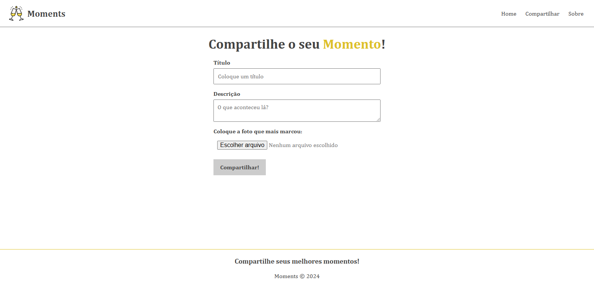

<h1 align="center">Moments</h1>

<p align="center">
    Projeto desenvolvido durante o curso de Angular 13, do canal Matheus Battisti - Hora de Codar, no YouTube.
</p>

<p align="center">
  
</p>

<br>

## Tópicos
- [Imagem do projeto](#img)
- [Sobre o projeto](#sobre)
- [Tecnologias utilizadas](#tec)
- [Executando o projeto](#execute)
- [Status do projeto](#status)
- [Licença](#license)

<br>

<h2 id="img">📸 Imagem do projeto</h2>



<br>

<h2 id="sobre">📖 Sobre o projeto</h2>

<p align="justify">Aplicação para cadastrar e excluir momentos incríveis vivenciados.</p>

<br>

<h2 id="tec">🤖 Tecnologias utilizadas</h2>

* HTML
* CSS
* TypeScript
* Angular
* Git
* Github

<br>

<h2 id="execute">📋 Executando o projeto</h2>

<h3>Pré-requisito</h3>

* [NodeJS LTS](https://nodejs.org/en/)
* [Angular 18](https://v18.angular.dev/installation)

<h3>Passo a passo</h3>

```bash
# Antes de executar a aplicação, acesse o repositório da API e siga o passo a passo para executá-la
$ https://github.com/Fel1324/MomentsAPI

# Clone este repositório
$ git clone https://github.com/Fel1324/Moments.git

# Acesse a pasta do projeto no terminal/cmd
$ cd Moments

# Instale as dependências do projeto
$ npm install

# Execute o projeto
$ ng serve
```
Para visualizar o projeto, acesse [http://localhost:4200](http://localhost:4200)

<br>

<h2 id="status">🚧 Status do projeto</h2>

Projeto finalizado ✅

<br>

<h2 id="license">📝 Licença</h2

Esse projeto está sob a licença MIT.
